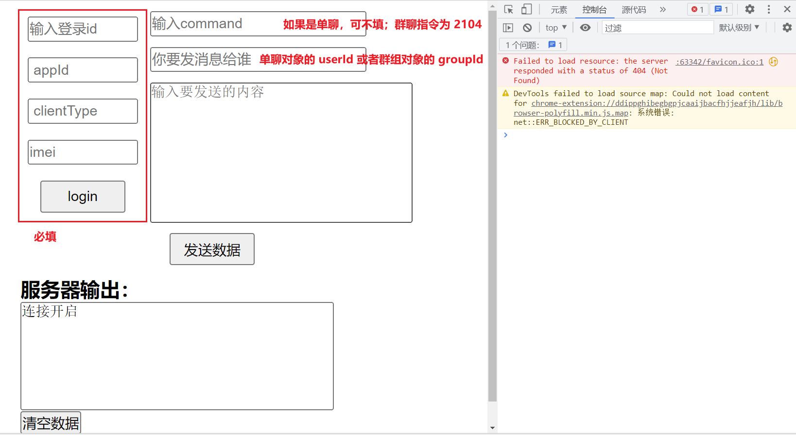
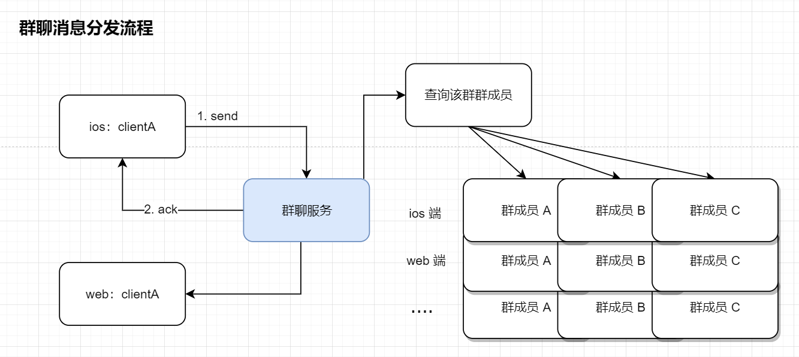
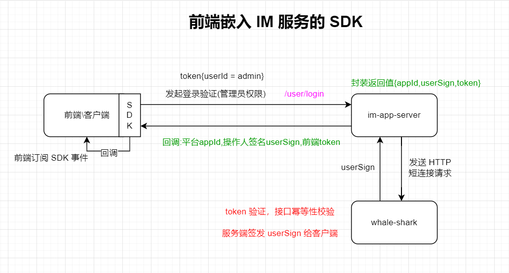

# WhaleShark
WhaleShark（鲸鲨）是基于 Netty 实现的高性能分布式 IM 即时通讯系统，它支持对接用户自定义多端登录方式，目前多端登录方式有单端、双端、三端以及无限制
<br>

## 技术栈
使用到 Netty、Redis、Redisson、RabbitMQ、Zookeeper、RPC、Feign 等主流技术栈
<br>
+ Netty 实现高性能消息收发，应用层握手(用户登录登出)，心跳检测(挂后台)
+ Redis 和 Redisson 客户端实现用户 Session 信息的存储、发布订阅模式实现路由层信息缓存
+ RabbitMQ 解耦对接 TCP 网关服务和逻辑层交互、保证分布式下消息顺序性
+ Zookeeper 注册中心及时感知服务节点上线下线情况
+ Feign RPC 方式解耦消息发送方合法性校验

## 模块职责介绍
采用 DDD 架构思想搭建各个模块层级，并使用大量设计模式优化架构，使项目易阅读、可扩展
<br>
项目树如下
```text
im-system-whale-shark
├─ im-codec    接入层：负责网关服务配置文件集成、私有协议包结构定义、消息编解码以及需要发送给 TCP 服务的数据包定义
├─ im-common   基础层：负责定义整个 IM 架构所有常量、状态码、错误码、基础数据模型
├─ im-domain   领域层：负责定义用户、好友、群组等多个领域的逻辑，以及消息的发送服务
├─ im-message-store 消息存储层：通过 MQ 将消息异步持久化落库, 很薄的一层
├─ im-service  服务层：负责定义底层组件如 redis、zk、mq 的配置逻辑，回调机制和基类消息发送
└─ im-tcp      网关层：负责定义心跳机制、监控用户消息读取以及上线下线、Netty 消息通道以及 WebSocket 全双工通道
```

## 亮点
* [x] 设计模式重构
  * 使用策略模式重构用户操作指令逻辑
  * 使用状态模式重构用户自定义多端登录方式
  * 使用模板模式重构消息接收器(群聊、单聊的消息接收器逻辑十分相似)
* [x] 使用 Redis 缓存用户信息的方式模拟路由层，实现跨服务之间的多 Channel 通讯
* [x] 使用 Redisson 发布订阅模式，监听用户登录行为，发送用户下线通知。存储用户多端设备的 Session 信息
* [x] 使用 Rabbitmq 处理分布式消息顺序性, 异步执行历史消息落库持久化等问题, 并且解决线上 MQ 消息积压和消息不一致等问题
* [x] 使用拦截器机制, 通过 HMAC-SHA256 加密算法实现接口加密防刷, 提升系统安全性
* [x] 单聊、群聊服务优化改造(实时性、有序性、可靠性、幂等性)
  * 实时性: 使用线程池、MQ 异步持久化、RPC 解耦合法性校验大幅提升消息实时性, 接口响应从 400ms 提升至 15ms
  * 可靠性: 通过应用层两次握手, 即发送方接收上、下行 ACK 确保消息可靠性, 解决消息丢失问题。消息丢包率从 6.32% 下降到 0
  * 有序性: 使用 Redis 原子递增 incr 保证消息有序性, 解决消息乱序问题
  * 幂等性: 通过防重 ID, 服务端、客户端缓存消息等幂等性手段遏制消息重复现象, 并限制消息的无限制重试, 接口异常情况从 8.13% 下降到 0
* [x] 实现单聊、群聊消息已读和已读回执功能
* [x] 采用读扩散实现单聊、群聊离线消息拉取

## 快速开始
### 数据库环境
导入 `whale-shark/assert/sql/im_core.sql` 文件

### Docker 环境部署
**如果是部署到服务端，注意防火墙是否拦截端口**

redis:
```shell
docker run -d --name redis -p 6379:6379 redis
```
zookeeper:
```shell
docker run -d --name zookeeper -p 2181:2181 zookeeper
```
rabbitmq:
```shell
docker run -d -p 5672:5672 -p 15672:15672 --name rabbitmq
```
+ 其中 15672 端口是连接 web 端页面的, 5672 端口是 Java 后端程序访问 rabbitmq 的

### 后端启动
后端有三个服务需要开启, 分别为:
+ im-tcp 包下的 Starter 程序 `com.bantanger.im.tcp.Starter`。它用于构建 TCP 网关服务, WebSocket、Socket 的连接, 消息发送, 回调以及路由等等基层操作。socket 的端口号是 `9001`, websocket 的端口号是 `19001`
+ im-domain 包下的 Application 程序 `com.bantanger.im.domain.Application`。它用于构建业务逻辑服务, 如用户、好友、群组的创建, 更改, 删除, 与数据库、缓存进行逻辑交互。端口号为 `8000`
+ im-message-store 包下的 Application 程序 `com.bantanger.im.message.Application`。它用于实现 MQ 异步消息落库存储服务。端口号为 `8001`

### py 脚本测试
`whale-shark/im-domain/src/test/python/` 包下所有测试文件都可运行

具体功能可自行研究, 现已用 websocket 全面代替

### websocket 测试
`whale-shark/im-tcp/src/main/resources/WebSocket.html`
暂时较为简陋, 本地测试, 需开启后端三个服务

主要浏览方式通过 F12 查看服务端发送的 `json` 格式是否正确


如图所示: 平台 [appId = 10001] 的用户 [userId=10001] 向群组 [groupId = 27a35ff2f9be4cc9a8d3db1ad3322804] 发送一条群组消息


## 架构设计
### 私有协议
IM 的私有协议确立信息如下：
```text
+------------------------------------------------------+
| 指令 4byte     | 协议版本号 4byte  | 消息解析类型 4byte  |
+------------------------------------------------------+
| 设备类型 4byte  | 设备号长度 4byte  | 平台ID 4byte      | 
+------------------------------------------------------+
| 数据长度 4byte  | 数据内容(设备号 imei 4byte + 请求体)   |
+------------------------------------------------------+
```
其中请求头共有：7 * 4 byte = 28 byte

### 读写扩散模型

+ 在架构中, 单聊会话消息采用写扩散


+ 在架构中, 群聊会话消息采用读扩散

### 消息同步模型
多端消息同步的弊端：

多端消息同步改进：

群聊消息同步流程：


### 状态码定义

详细请看：`com.bantanger.im.common.enums.command`

#### 单聊状态码：

| 消息详细内容                                                 | 对应状态码    |
| ------------------------------------------------------------ | ------------- |
| 单聊消息发送指令                                             | 1103（0x44F） |
| 单聊消息 ACK（服务端接收发送方消息的确认应答，用于发送方消息多端同步） | 1046（0x416） |
| 单聊消息收到 ACK（服务端代替离线用户接收消息的确认应答）     | 1107（0x453） |
| 单聊消息已读确认                                             | 1106（0x452） |
| 单聊消息已读通知给同步端                                     | 1053（0x41D） |
| 单聊消息已读回执，给原消息发送方                             | 1054（0x41E） |

#### 群聊状态码：

| 消息详细内容                                                 | 对应状态码    |
| ------------------------------------------------------------ | ------------- |
| 群聊消息发送指令                                             | 2104（0x838） |
| 群聊消息 ACK（服务端接收发送方消息的确认应答，用于发送方消息多端同步） | 2047（0x7ff） |
| 群聊消息已读确认                                             | 2106（0x83a） |
| 群聊消息已读通知给同步端                                     | 2053（0x805） |
| 群聊消息已读回执，给原消息发送方                             | 2054（0x806） |

## 前后端对接
IM 服务采用 SDK 方式集成到前端代码。一个大致的流程演示如下:
