# IM-WhaleShark
<div align="center">  


IM-WhaleShark（鲸鲨）是基于 Netty 实现的高性能分布式 IM 即时通讯系统

[介绍](#介绍) | [快速开始](#快速开始) | [技术栈](#技术栈) | [模块职责](#模块职责) | [功能实现](#亮点) | [架构设计](#架构设计) | [状态码简述](#状态码定义) | [与我联系](#联系)

</div>

## 介绍
IM-WhaleShark（鲸鲨）是基于 Netty 实现的高性能分布式 IM 即时通讯系统，它支持对接用户自定义多端登录方式，它实现了消息的四大特性（实时、有序、可靠、幂等），架构层面吸收业界大牛的技术文章以及成熟产品实现，特别适合新手小白进行 IM 的学习与参考

可借助 Devin 辅助学习: https://deepwiki.com/BanTanger/im-whale-shark/1-overview

## 技术栈
使用到 Netty、Redis、Redisson、RabbitMQ、Zookeeper、RPC、Feign 等主流技术栈
<br>
+ Netty 实现高性能消息收发，应用层握手(用户登录登出)，心跳检测(挂后台)
+ Redis 和 Redisson 客户端实现用户 Session 信息的存储、发布订阅模式实现路由层信息缓存
+ RabbitMQ 解耦对接 TCP 网关服务和逻辑层交互、保证分布式下消息顺序性
+ Zookeeper 注册中心及时感知服务节点上线下线情况
+ Feign RPC 方式解耦消息发送方合法性校验

## 模块职责
采用 DDD 架构思想搭建各个模块层级，并使用大量设计模式优化架构，使项目易阅读、可扩展
<br>
项目树如下
```text
im-system-whale-shark
├─ im-codec           接入层：负责网关服务配置文件集成、私有协议包结构定义、消息编解码以及需要发送给 TCP 服务的数据包定义
├─ im-common          基础层：负责定义整个 IM 架构所有常量、状态码、错误码、基础数据模型
├─ im-domain          领域层：负责定义用户、好友、群组等多个领域的逻辑，以及消息的发送服务
├─ im-message-store   消息存储层：通过 MQ 将消息异步持久化落库, 很薄的一层
├─ im-infrastructure  基础层：负责定义底层组件如 redis、zk、mq 的配置逻辑，回调机制和基类消息发送
└─ im-tcp             网关层：负责定义心跳机制、监控用户消息读取以及上线下线、Netty 消息通道以及 WebSocket 全双工通道
```

## 亮点
* [x] 设计模式重构
  * 使用策略模式重构用户操作指令逻辑
  * 使用状态模式重构用户自定义多端登录方式
  * 使用模板模式重构消息接收器(群聊、单聊的消息接收器逻辑十分相似)
* [ ] 使用 Redis 缓存用户信息的方式模拟路由层，实现跨服务之间的多 Channel 通讯
* [x] 使用 Redisson 发布订阅模式，监听用户登录行为，发送用户下线通知。存储用户多端设备的 Session 信息
* [x] 使用 Rabbitmq 处理分布式消息顺序性, 异步执行历史消息落库持久化等问题, 并且解决线上 MQ 消息积压和消息不一致等问题
* [x] 使用拦截器机制, 通过 HMAC-SHA256 加密算法实现接口加密防刷, 提升系统安全性
* [x] 单聊、群聊服务优化改造(实时性、有序性、可靠性、幂等性)
  * 实时性: 使用线程池、MQ 异步持久化、RPC 解耦合法性校验大幅提升消息实时性, 接口响应从 400ms 提升至 15ms
  * 可靠性: 通过应用层两次握手, 即发送方接收上、下行 ACK 确保消息可靠性, 解决消息丢失问题。消息丢包率从 6.32% 下降到 1.64%
  * 有序性: 使用 Redis 原子递增 incr 保证消息有序性, 解决消息乱序问题
  * 幂等性: 通过防重 ID, 服务端、客户端缓存消息等幂等性手段遏制消息重复现象, 并限制消息的无限制重试, 接口异常情况从 8.13% 下降到 1.47%
* [x] 实现单聊、群聊消息已读和已读回执功能
* [x] 采用读扩散实现单聊、群聊离线消息拉取

## 快速开始

### 服务器方式部署

> 采用 docker compose 实现快速部署

首先要确保您的服务器上有 git、docker 以及 docker-compose

可参考自行下载: [服务器下载 Git、Docker、Docker-Compose](docker/docker.md)

#### 粗粒度部署方式:

1. 克隆本项目

```bash
git clone https://github.com/BanTanger/im-whale-shark.git
```

2. 根目录下运行 build 脚本

```bash
sh build.sh
```
- 会将各个模块打包，执行 docker-compose，届时通过终端观察 im-whaleshark 日志(根目录 logs 包记录各模块运行日志)

#### 细粒度部署方式:

1. 克隆本项目

```bash
git clone https://github.com/BanTanger/im-whale-shark.git
```

2. 为脚本执行赋予权限并执行

```bash
cd script
chmod +x *.sh
```
```bash
sh clean.sh
sh copy.sh
```
- 将各个模块的 jar 包和 Dockerfile 移动到 docker/build 包下

3. 部署项目

```bash
sh deploy.sh base
```
- 将基础组件部署到 docker
```bash
sh deploy.sh serives
```
- 将后端的三个模块部署到 docker

4. 开启防火墙
```bash
./open_port.sh
```

停用、删除: 
```bash
sh deploy.sh stop
```
- 将 docker 的所有容器停用

```bash
sh deploy.sh rm
```
- 将 docker 的所有容器删除

清空 build 文件夹:
```bash
./clean.sh
```

### 本地方式部署

#### 数据库环境
导入 `whale-shark/assert/sql/im_core.sql` 文件

#### Docker 环境部署
**如果是部署到服务端，注意防火墙是否拦截端口**

redis:
```shell
docker run -d --name redis -p 6379:6379 redis
```
zookeeper:
```shell
docker run -d --name zookeeper -p 2181:2181 zookeeper
```
rabbitmq:
```shell
docker run -d -p 5672:5672 -p 15672:15672 rabbitmq
```
+ 其中 15672 端口是连接 web 端页面的, 5672 端口是 Java 后端程序访问 rabbitmq 的

#### 后端启动
后端有三个服务需要开启, 分别为:
+ im-tcp 包下的 Starter 程序 `com.bantanger.im.tcp.Starter`。它用于构建 TCP 网关服务, WebSocket、Socket 的连接, 消息发送, 回调以及路由等等基层操作。socket 的端口号是 `9001`, websocket 的端口号是 `19001`
+ im-domain 包下的 Application 程序 `com.bantanger.im.domain.Application`。它用于构建业务逻辑服务, 如用户、好友、群组的创建, 更改, 删除, 与数据库、缓存进行逻辑交互。端口号为 `8000`
+ im-message-store 包下的 Application 程序 `com.bantanger.im.message.Application`。它用于实现 MQ 异步消息落库存储服务。端口号为 `8001`

注意 tcp Application 方式启动需要配置 parameter args 

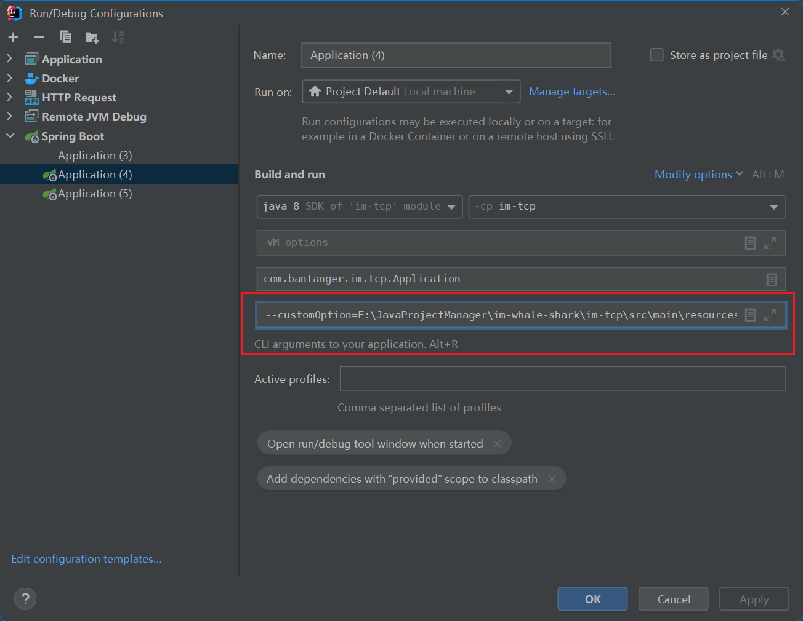

[//]: # (### py 脚本测试)

[//]: # (`whale-shark/im-domain/src/test/python/` 包下所有测试文件都可运行)

[//]: # ()
[//]: # (具体功能可自行研究, 现已用 websocket 全面代替)

### websocket 测试
`whale-shark/im-tcp/src/main/resources/WebSocket.html`
暂时较为简陋, 本地测试需开启后端三个服务并打开 WebSocket 页面

Docker 部署测试请访问 `localhost:19000`

浏览方式通过 F12 查看服务端发送的 `json` 格式是否正确


如图所示: 平台 [appId = 10001] 的用户 [userId = 10001, clientType = 3, imei = 200] 在登录 Login 之后向群组 [groupId = 27a35ff2f9be4cc9a8d3db1ad3322804] 通过操作指令`群发模式`[command = 2104] 发送一条群组消息


## 架构设计
### 私有协议
IM 的私有协议确立信息如下：
```text
+------------------------------------------------------+
| 指令 4byte     | 协议版本号 4byte  | 消息解析类型 4byte  |
+------------------------------------------------------+
| 设备类型 4byte  | 设备号长度 4byte  | 平台ID 4byte      | 
+------------------------------------------------------+
| 数据长度 4byte  | 数据内容(设备号 imei 4byte + 请求体)   |
+------------------------------------------------------+
```
其中请求头共有：7 * 4 byte = 28 byte

### 消息存储

#### 数据结构设计
必须要有 msgID 作为消息的唯一标识, 其必须满足四个特性

1. 全局唯一: 不能出现重复的 ID 号，既然是唯一标识，这是最基本的要求
2. 趋势递增: 在 MySQL InnoDB 引擎中使用的是聚集索引，由于多数 RDBMS 使用 B-tree 的数据结构来存储索引数据，在主键的选择上面我们应该尽量使用有序的主键保证写入性能。
3. 单调递增: 保证下一个 ID 一定大于上一个 ID，例如事务版本号，IM 增量消息、排序等等
4. 非连续: 如果 ID 是连续的，那么恶意用户就能轻易的编写程序扒取信息了，因此需要 ID 无规则、不规则

其中 2、3 的特性是为了实现消息的可排序性，即生成的 ID 应该具有可排序性，以便根据 ID 的顺序进行查询和排序操作。虽说 create_time 也能做排序，但为其建立索引是一个比较愚笨的操作，索引的维护成本也比较大

#### 生成方式

#### 存储方式
异步存储，消息先通过服务端做校验做同步，再异步存储到数据库里

#### 云端


### 消息投递过程
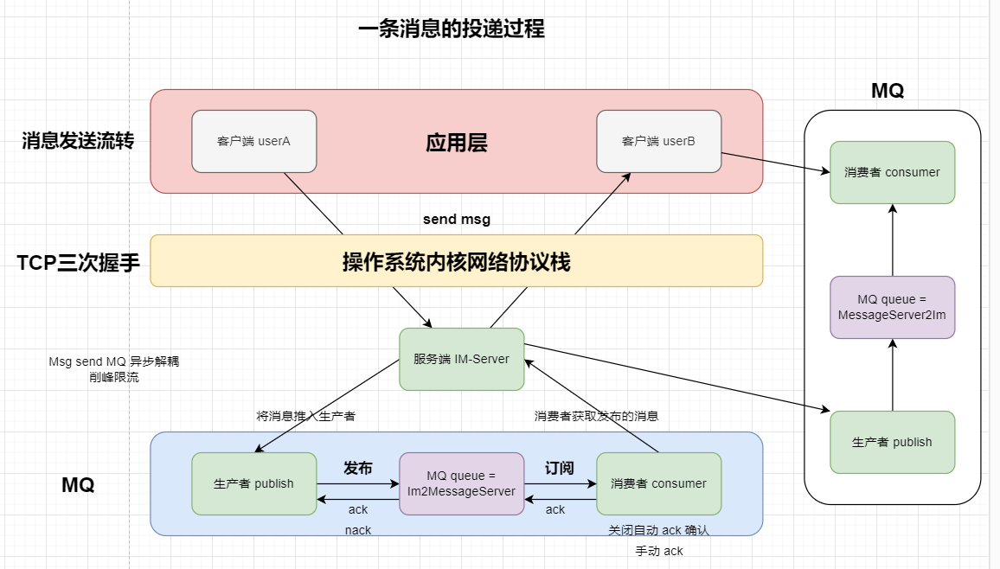

流程如下：
1. 客户端 userA 发送一条消息到服务器, 消息通过私有协议转化为二进制序列化, 通过 TCP 三次握手保证消息在传输层的稳定性（上下行 ACK 保证消息在应用层的稳定性 ）
2. 服务器将消息投递到 MQ 生产者
   1. 生产者将这条消息推送到 MQ 的指定队列 (queue = pipeline2MessageService) 进行处理
   2. 消费者通过订阅消息传输队列接收这条消息
3. 服务端通过将消息投递到 MQ 指定队列 (queue = MessageService2pipeline) 进行处理
4. 客户端 userB 成功接收服务端投递过来的消息, 完成整个消息的发送接收

服务端通过 MQ 将消息传回是为什么?

> 保证消息的可靠传达

当然, 也可采用 TCP、UDP 连接甚至是 HTTP 短连接也行，只不过这样会需要更多的设计

> 2024.2.20 补充
> 
> 实际上这是种投机取巧的法子，因为本质上用 MQ 解耦是因为分布式场景下各个 Netty 之间没有直接的通道来投递消息（目前架构里），所以采用 MQ 来实现跨机器的双方消息投递，
> 但如果让各个 Netty 节点之间两两也建立起 socket 连接，那么就可以实现基于 TCP、UDP 连接的消息投递

### 路由层
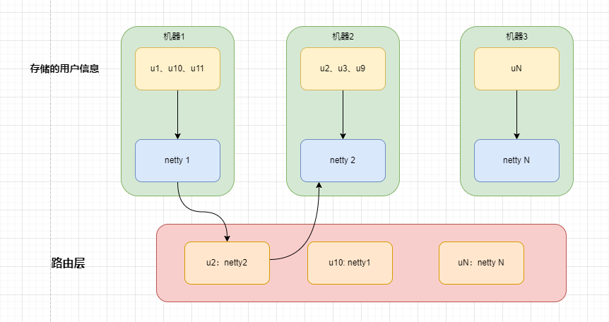

由于使用了分布式, 用户的信息会因为负载均衡分布在不同的服务器上，怎么保证多 Channel 的跨节点通讯就显得额外的重要。

在这里我们使用了 Redis 来模拟路由层, MQ 进行消息解耦, k-v 分别为 toUserId 和目标用户所在的服务器节点。当然, 可能会出现同一个 toUserId 对应多个路由层节点，对于此我们只取第一个成功获取即可

消息请求通过 Netty 传递到路由层，在路由层上有高速缓存表，可以快速的获取到消息传递的目的地，并且由于路由层是无状态的，可以很方便进行水平扩容，搭建集群

流程如下：
1. 发送方将消息发送到自己所在的节点。
2. 发送方所在的节点进行消息路由，根据接收方所在的节点，将消息路由到对应的节点。
   1. 由于我们在用户的 Session 中设计了 brokerId 和 ip 地址, 因此我们可以获取到对方的节点
   2. 之后的通讯通过 MQ 解耦消息的接收, 
3. 接收方在自己所在的节点上接收到消息并处理。

在这里我选择使用 MQ 进行服务端和客户端的解耦，理由有二:
如果使用传统方式(点对点、广播)，都需要涉及到消息数据的发送, 怎么保证消息能够发送到对应节点是一个非常难以把控的事情。
因此我使用 MQ + Redis 的方式, redis 作为集中路由, value 里包含了 brokerId 和 port 
每一个机器都绑定自己对应的 MQ 队列

> 但其实本质上是集中式路由，所有的消息都通过中央服务器进行路由，中央路由器中央服务器根据消息的接收方信息来决定将消息路由到哪个节点。相比分布式路由，集中式路由实现简单，但是中央服务器成为了系统的瓶颈(单点故障)，可能会限制系统的性能和可扩展性。

> 分布式路由：将消息路由的权力分散到各个节点中，每个节点都可以进行消息的路由请求处理。这种方式可以提高系统的可扩展性和容灾性，但实现会比较复杂。(后续真正实现路由层的时候会考虑分布式路由的架构设计)

> 2024.2.16 补充：理想分布式路由实现
> 
> 不依赖固定组件（或者叫中心）实现管理，而是各个 netty 之间都具备数据转发与处理的能力，各个 netty 节点之间两两相连（建立 tcp 连接，socket 通道），实现去中心化的能力。就如同 kafka 2.8 之后取消了 zk 做管理中心，各节点的管理和推举通过 raft 算法实现

### 读写扩散模型
#### 写扩散
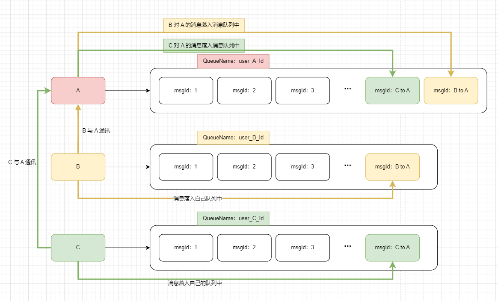
+ 在架构中, 单聊会话消息采用写扩散

写扩散优缺：

优点：

+ 控制逻辑与数据读取逻辑简单； 
+ 用户数据独立，满足更多的业务场景，比如：回执消息、云端删除等等； 
+ 一个数据点丢失，不影响其他用户的数据点。

缺点：

+ 存储空间的增加； 
+ 写扩散需要专门的扩散队列； 
+ 先写扩散后读，实时性差。

#### 读扩散
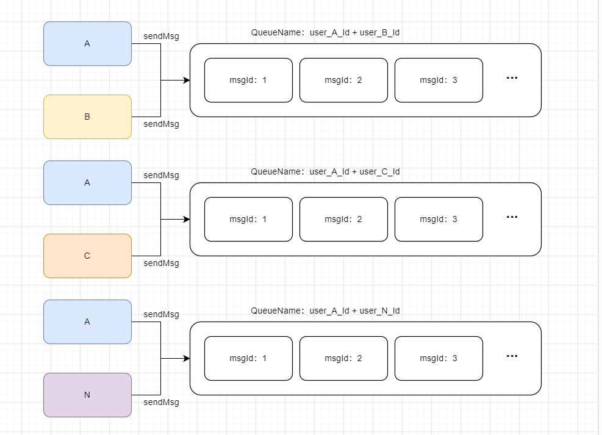
+ 在架构中, 群聊会话消息采用读扩散

读扩散优缺：

优点：

+ 数据实时性高； 
+ 写入逻辑简单； 
+ 节约存储空间。

缺点：

+ 数据读取会存在热点问题； 
+ 需要维护离线群成员与未读消息的关系。

### 消息同步模型
#### 多端消息同步的弊端：
由于 WhaleShark 实现了用户多端同步，因此需要保证一条消息既同步给发送方的其他端，又得保证消息能发送给目标对象的所有端。一条消息的处理流程如下：

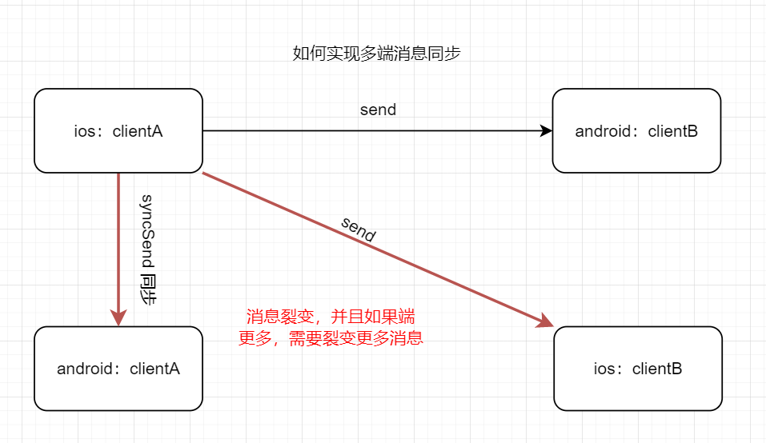

如架构图所演示，一条消息如图所示就裂变成三条消息了，如果说端的类型更多 (设计上是有六种端: Windows、Mac、Web、Android、IOS、WebApi) 但实际上我们基本是通过 WebApi 来接收消息, 再同步给其他端，也就需要裂变出 `5 * 5 - 1 = 24` 条消息

一口气发送如此多条消息对于服务器来说，压力是巨大的，因此我们需要重新设计一些策略来实现消息同步

#### 多端消息同步改进：
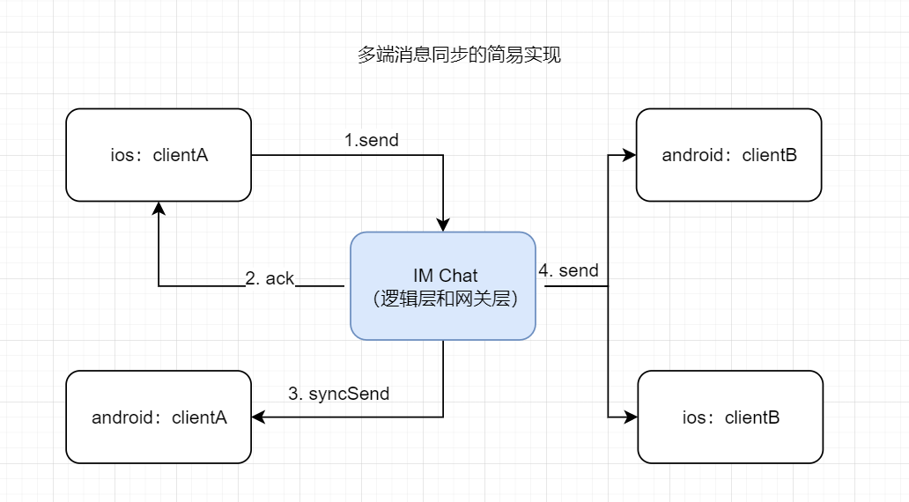
1. 发送方 userA 发送消息给服务端
2. 服务端接收发送方的消息之后向发送方回应消息接收确认 ACK 数据包表示服务端已经成功接收消息
3. 先将消息同步给发送方其他端（在线端使用 TCP 通知投递，离线端存储最新的 1000 条数据到离线消息队列里）
4. 发送消息给接收方所有端

#### 群聊消息同步流程：

1. 发送方 userA 发送消息给服务端
2. 服务端接收发送方的消息之后向发送方回应消息接收确认 ACK 数据包表示服务端已经成功接收消息
3. 先将消息同步给发送方其他端（在线端使用 TCP 通知投递，离线端存储最新的 1000 条数据到离线消息队列里）
4. 查询该群所有群成员，排除自己，发送消息

应用层的消息可靠传输依靠 MQ 实现，**既是异步解耦，又是削峰限流**

### 消息可靠传达模型
我们难以保证消息全都可靠传达，不会产生丢失现象，在 IM 系统中也不允许丢失一条消息。如下图：


+ 在传输层，TCP的三次握手保证了双方通讯的可靠性，稳定性。简而言之，用户发送的消息，
在忽视应用层的情况下，无论如何都会从自身主机的 “发送缓冲区” 抵达对方主机的 “接收缓冲区”
+ 在应用层，数据包有可能因为用户突然的切后台或者是弱网状态导致没法从操作系统内核抵达应用层，反之也是如此,
为此,我们需要在应用层做好可靠传输协议的保证，防止数据丢失的情况

> 如果只是单台机器进行双向通信，则不会经历传输层拆包装包的过程，而是直接将数据包通过内核拷贝到另一个进程(socket)进行通讯

在设计上，我们采用应用层两次握手（上下行 ACK）来保证消息在应用层的可靠传达
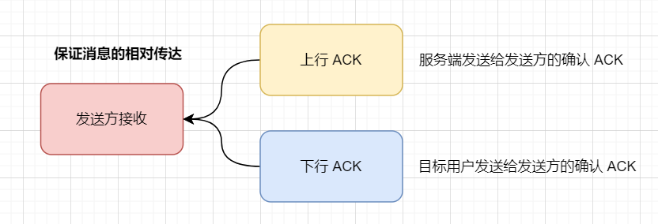
+ 上行 ACK：服务端发送给消息发送方的接收确认 ACK
+ 下行 ACK：目标用户发送给消息发送方的接收确认 ACK

> ACK 应答报文中的数据格式：
> 
> CheckACK(String messageId, String messageSequence)

ps: 其实这个下行 ACK 的设计有点多余，我的处理是消费者成功消费 mq 消息之后回返一个确认 ACK 给发送方,
但 MQ 中间件到消费者, 本身就是一个强可靠保证，如果出现消息丢失，
MQ 中间件方面，我们可以在 MQ 中间件开启持久化和镜像队列,
消费者方面，取消自动提交而转为消息成功消费后手动提交的方式

ps: 上行 ACK 也同理, 服务端的消息发送实际抵达 MQ 时有一个偏移量返回值，我们可以拿返回值做文章，如果说返回值 > 0
代表这条消息已经成功从服务端抵达 MQ 了, 接着就是 message 数据架构体新增几个字段 
RecvID, ServerID, ClientID, SendTime 做冗余避免查库提升性能

#### 在线用户消息接收
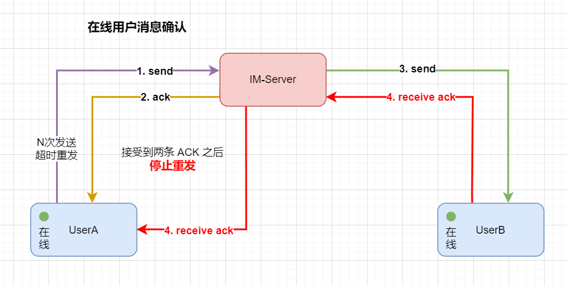

#### 离线用户消息接收
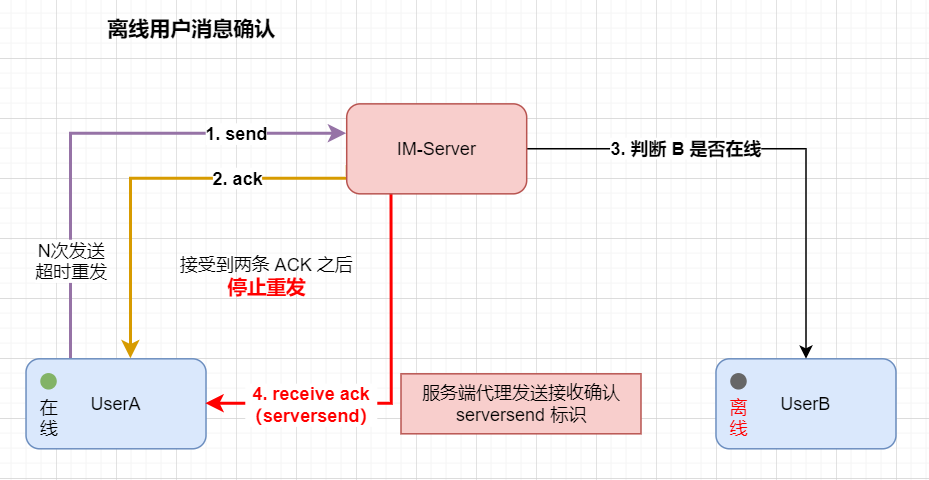

#### ACK 丢失现象
下面分别探讨上下行 ACK 丢失现象的处理流程

ACK 丢失现象解决策略: 由于我们 ack 中含有 msgId, 可以在客户端维护一个**等待 ACK 接收队列**，客户端（发送方）发送消息之后，
在本地维护当前消息的 msgId，直到上行、下行 ACK 都被接收方确认之后才将这条消息从队列里移除
+ 当上行 ACK 丢失，发送方认为要么是服务端 ACK 由于网络波动晚抵达了，要么是服务端没有接受到自己发送的消息，无论是哪种情况，都会进行消息的超时重投（沿用上一次的 msgId，做防重处理）
+ 当下行 ACK 丢失，发送方**只会认为**是服务端没有将消息发送过来，到底是服务端没有接受到在线用户的接收确认还是代替离线用户发送接收确认数据包丢失，客户端并不关心，消息超时重投

### 消息幂等性保证
为了实现消息可靠，我们设计了上下行 ACK 以保证应用层两次握手，但问题也很明显，为了可靠性就无法避免的会出现消息重复的现象。

思考这样一个场景：发送方 A 发送一条消息给在线用户 B，已经成功接受到服务端的确认 ACK，等待接收方的确认 ACK，
发送方本地没有接受到下行 ACK，并且计时器也已经超时，A 认为 B 没有接受到数据，进行消息重发，但其实 B 成功接收到数据并已经异步持久化了，
只是由于网络波动没有及时返回确认 ACK，当 A 再次发送消息之后 B 的确认 ACK 才到达，这样就导致了消息重复的现象

我们可以通过一些简单的手段来遏制，比如说防重 id 来防止同一份数据处理多次加载到数据库，

或者是消息到达时做一个缓存，缓存时间尽量短，缓存时间内的消息重试直接让接收方接收消息，不进行二次持久化。

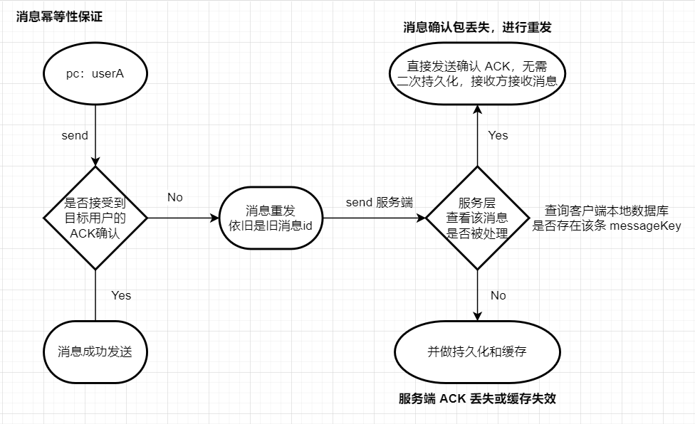

为了避免客户端无限制重发的现象，我们可以对缓存做一个过期时间，只有在过期时间之前的缓存才能做幂等；
当超过缓存时间时, 服务端忽略重投的消息, 直到客户端计时器超时并且已经超过了最大重试次数，
才让客户端重新生成消息唯一id：messageId, 也就是重新做一个消息体


### 消息有序性保证
为了提高消息在服务端的处理流程(MQ消费,落库存储,ACK确认)，我们在程序实现中采用了线程池技术来提高消息处理时长

但多线程也带来一个问题，消息的处理并不是线性的，在单聊逻辑中，假设两人回应的时间足够短，在多线程下有可能会导致消息的串行处理，打破消息的有序性

对此在数据库表的设计中，为每一条消息体都增添了一个 messageId 做唯一标识，

### 状态码定义

详细请看：`com.bantanger.im.common.enums.command`

#### 单聊状态码：

| 消息详细内容                                                 | 对应状态码    |
| ------------------------------------------------------------ | ------------- |
| 单聊消息发送指令                                             | 1103（0x44F） |
| 单聊消息 ACK（服务端接收发送方消息的确认应答，用于发送方消息多端同步） | 1046（0x416） |
| 单聊消息收到 ACK（服务端代替离线用户接收消息的确认应答）     | 1107（0x453） |
| 单聊消息已读确认                                             | 1106（0x452） |
| 单聊消息已读通知给同步端                                     | 1053（0x41D） |
| 单聊消息已读回执，给原消息发送方                             | 1054（0x41E） |

#### 群聊状态码：

| 消息详细内容                                                 | 对应状态码    |
| ------------------------------------------------------------ | ------------- |
| 群聊消息发送指令                                             | 2104（0x838） |
| 群聊消息 ACK（服务端接收发送方消息的确认应答，用于发送方消息多端同步） | 2047（0x7ff） |
| 群聊消息已读确认                                             | 2106（0x83a） |
| 群聊消息已读通知给同步端                                     | 2053（0x805） |
| 群聊消息已读回执，给原消息发送方                             | 2054（0x806） |

## 开发规范

打开地址 [im-whale-shark](https://github.com/BanTanger/im-whale-shark) 

Fork 代码到自己的仓库

熟悉工程模型和代码，并调试运行理解整个框架的设计实现。

```text
# 主要type
feat:     增加新功能
fix:      修复 bug

# 特殊type
docs:     只改动了文档相关的内容
style:    不影响代码含义的改动，例如去掉空格、改变缩进、增删分号
build:    构造工具的或者外部依赖的改动，例如 webpack，npm
refactor: 代码重构时使用
revert:   执行 git revert 打印的 message

# 暂不使用type
test:     添加测试或者修改现有测试
perf:     提高性能的改动
ci:       与 CI（持续集成服务）有关的改动
chore:    不修改 src 或者 test 的其余修改，例如构建过程或辅助工具的变动
```

[//]: # (## 前后端对接)

[//]: # (IM 服务采用 SDK 方式集成到前端代码。一个大致的流程演示如下:)

[//]: # ()
[//]: # (![SDK执行流程]&#40;assert/design/photo/SDK执行流程.png&#41;)

[//]: # (对此我已经大致实现了后端的一个 im-app-server 与前端的 SDK 进行对接，欢迎前端同学与我一起来完善 WhaleShark)

## 联系
如果有什么不懂的设计, 可通过提 ISSUE 或者是加我微信进行探讨

欢迎与我联系交流，我拉你进交流群，微信二维码为（注明来意喔~）：


## Star History

[](https://star-history.com/#BanTanger/im-whale-shark&Date)
